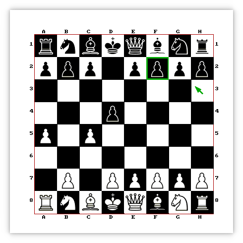

# Minimal multiplayer chess game



## Deps
It uses allegro 4.

## Build
```
make
```

## Usage

Player1 (server):
```
./sakk 1234  # port
```

Player2 (client):
```
./sakk 127.0.0.1 1234  # server's ip and port
```

